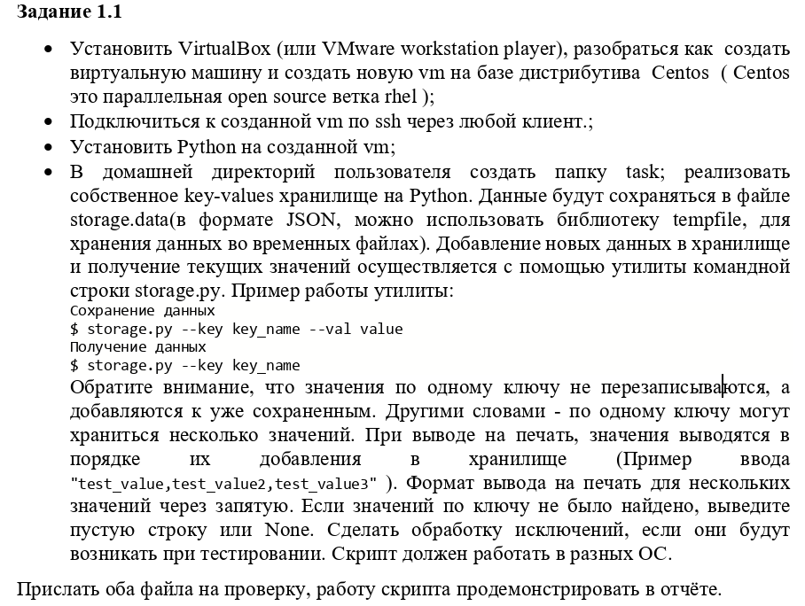
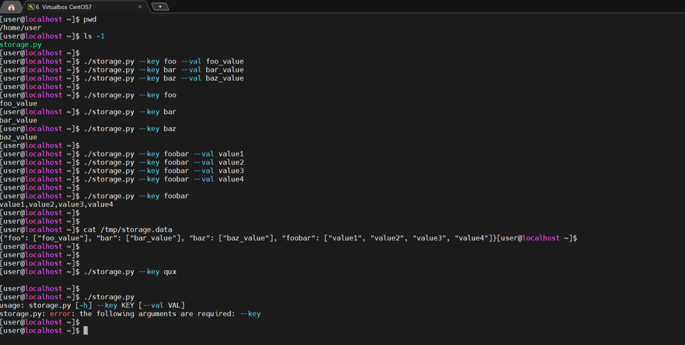

## Задание 1.1
  


## 1. Add user and ssh key
#### add user
`adduser user`  
`passwd user`  
`gpasswd -a user wheel`  
`lid -g wheel`  
```console
user(uid=1000)
```
#### add public key
copy `id_ed25519.pub` from host to box  
`mkdir -p ~/.ssh && touch ~/.ssh/authorized_keys`  
`cat ~/.ssh/id_ed25519.pub >> ~/.ssh/authorized_keys`  

## 2. Install Python 3.9.15
`sudo yum -y install epel-release`  
`sudo yum -y update`  
`sudo yum groupinstall "Development Tools" -y`  
`sudo yum install openssl-devel libffi-devel bzip2-devel -y`  
`sudo yum install wget -y`  
`wget https://www.python.org/ftp/python/3.9.15/Python-3.9.15.tgz`  
`tar xvf Python-3.9.15.tgz`  
`cd Python-3.9*/`  
`./configure --enable-optimizations`  
`sudo make altinstall`  
`python3.9 --version`  
```console
Python 3.9.15
```
`pip3.9 --version`  
```console
pip 22.3 from /usr/local/lib/python3.9/site-packages/pip (python 3.9)
```
`/usr/local/bin/python3.9 -m pip install --upgrade pip`  


## 3. Python utility
[storage.py](storage.py)


## 4. Python utility
[storage.data](storage.data)


## 5. Utility Demo
  
