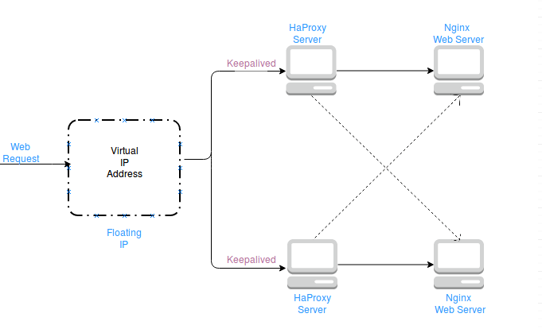
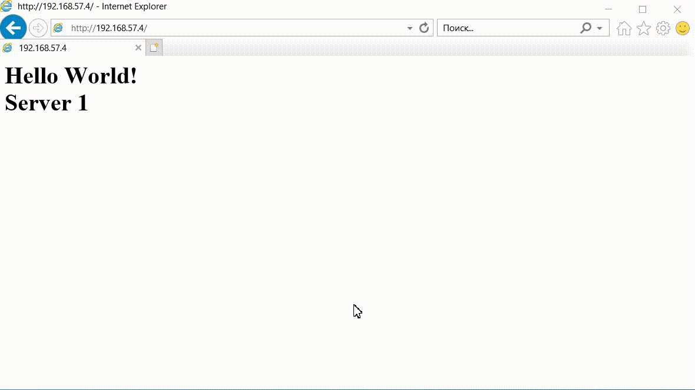

## TASK 2.1
[Task text](task_text_2.1.png)


### Task solution
  

- VM-1 (192.168.57.4): NGINX webserver # 1  
- VM-2 (192.168.57.5): NGINX webserver # 2  
- VM-3 (192.168.57.6): HAproxy and Keepalived server # 1 (master node)  
- VM-4 (192.168.57.7): HAproxy and Keepalived server # 2 (backup node)  
- Keepalived floating (virtual) IP: 192.168.57.10  


### First way: Bash scripts
<details>
  <summary>OPEN</summary>

1. **[Install NGINX script](install_nginx.sh)**
2. **[Install HAproxy and Keepalived script](install_haproxy_keepalived.sh)**

### Validation of working balancer and keepalived router failover:


---

#### Run NGINX installing script on VM-1
```console
cd ~
wget -N https://raw.githubusercontent.com/sudmed/servionica_cloud_task/main/task_2.1/install_haproxy_keepalived.sh
sudo chmod +x install_haproxy_keepalived.sh
sudo ./install_nginx.sh -c="<H1>Hello World! <br /> Server 1</H1>"
```
[STDOUT](VM-1_output.txt)  

---

#### Run NGINX installing script on VM-2
```console
cd ~
wget -N https://raw.githubusercontent.com/sudmed/servionica_cloud_task/main/task_2.1/install_haproxy_keepalived.sh
sudo chmod +x install_haproxy_keepalived.sh
sudo ./install_nginx.sh -c="<H1>Hello World! <br /> Server 2</H1>"
```
[STDOUT](VM-2_output.txt)  

---

#### Run HAproxy and Keepalived installing script on VM-3 (master node)
```console
cd ~
wget -N https://raw.githubusercontent.com/sudmed/servionica_cloud_task/main/task_2.1/install_haproxy_keepalived.sh
sudo chmod +x install_haproxy_keepalived.sh
sudo ./install_haproxy_keepalived.sh -n=192.168.57.6 -s=master -v=192.168.57.10 -w1=192.168.57.4 -w2=192.168.57.5 -p="eyhZK+8TmdkWLH+SXuQ="
```
[STDOUT](VM-3_output.txt)  

---

#### Run HAproxy and Keepalived installing script on VM-4 (backup node)
```console
cd ~
wget -N https://raw.githubusercontent.com/sudmed/servionica_cloud_task/main/task_2.1/install_haproxy_keepalived.sh
sudo chmod +x install_haproxy_keepalived.sh
sudo ./install_haproxy_keepalived.sh -n=192.168.57.7 -s=backup -v=192.168.57.10 -w1=192.168.57.4 -w2=192.168.57.5 -p="eyhZK+8TmdkWLH+SXuQ="
```
[STDOUT](VM-4_output.txt)  
</details>

### Second way: Docker compose
<details>
  <summary>OPEN</summary>

</details>


### Third way: Docker swarm
<details>
  <summary>OPEN</summary>

</details>
