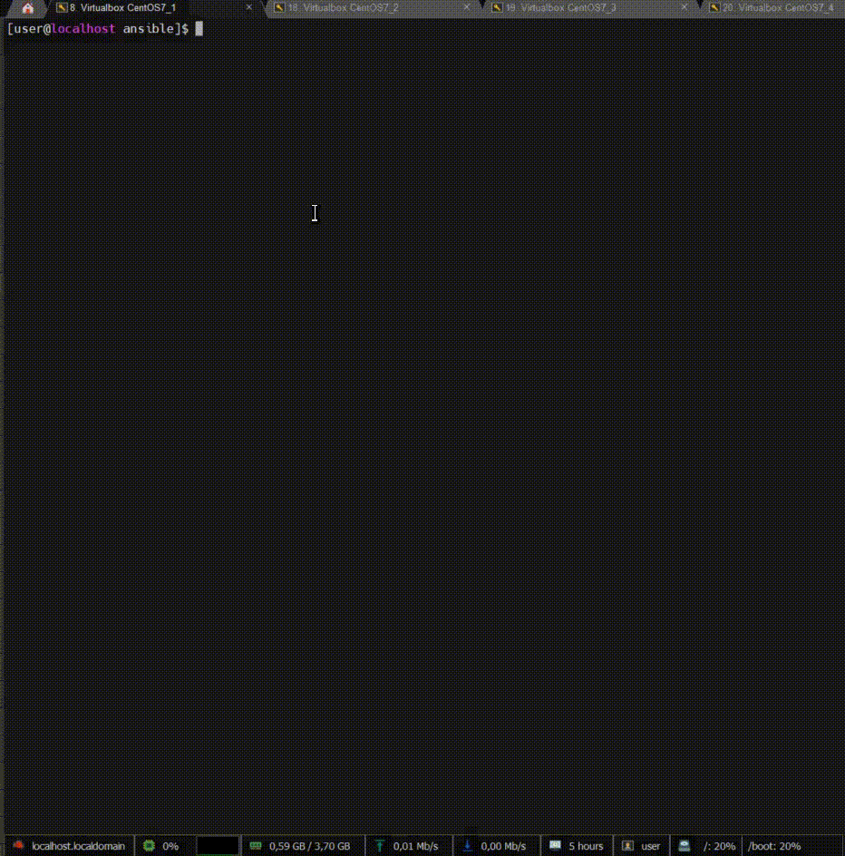

## Task 2.2

[Task text](task_text_2.2.png)


### Task solution

### Ansible files tree
<details>
  <summary>OPEN</summary>

```console
ansible
├── ansible.cfg
├── group_vars
│   ├── all
│   │   └── vars
│   ├── loadbalancers
│   └── webservers
├── hosts
├── host_vars
│   ├── ha1
│   ├── ha2
│   ├── web1
│   └── web2
├── infra.txt
├── nginx_haproxy_ha.yml
├── roles
│   ├── ansible-ssh-copy-id
│   │   ├── README.md
│   │   ├── tasks
│   │   │   └── main.yml
│   │   └── vars
│   │       └── main.yml
│   ├── ha-proxy
│   │   ├── handlers
│   │   │   └── main.yml
│   │   ├── README.md
│   │   ├── tasks
│   │   │   └── main.yml
│   │   └── templates
│   │       └── haproxy.cfg.j2
│   ├── keepalived
│   │   ├── handlers
│   │   │   └── main.yml
│   │   ├── README.md
│   │   ├── tasks
│   │   │   └── main.yml
│   │   ├── templates
│   │   │   └── keepalived.conf.j2
│   │   └── vars
│   │       └── main.yml
│   └── nginx
│       ├── handlers
│       │   └── main.yml
│       ├── README.md
│       ├── tasks
│       │   └── main.yml
│       ├── templates
│       │   ├── index.html.j2
│       │   └── nginx.conf.j2
│       └── vars
│           └── main.yml
└── tmux.sh
```

</details>

### Infrastructure details
<details>
  <summary>OPEN</summary>

**4 VM boxes with CentOS**
- VM-1 (192.168.57.4): NGINX webserver # 1  
- VM-2 (192.168.57.5): NGINX webserver # 2  
- VM-3 (192.168.57.6): HAproxy and Keepalived server # 1 (master node)  
- VM-4 (192.168.57.7): HAproxy and Keepalived server # 2 (backup node)  
- Keepalived floating (virtual) IP: 192.168.57.10  

</details>
  

### Validation of running role and simple monitoring with `watch` command
<details>
  <summary>OPEN</summary>



</details>


### Run Ansible playbook and its output
<details>
  <summary>OPEN</summary>

```console
ansible-playbook nginx_haproxy_ha.yml -i ./hosts -K
```
[STDOUT](STDOUT_nginx_haproxy_ha.txt)  

</details>
